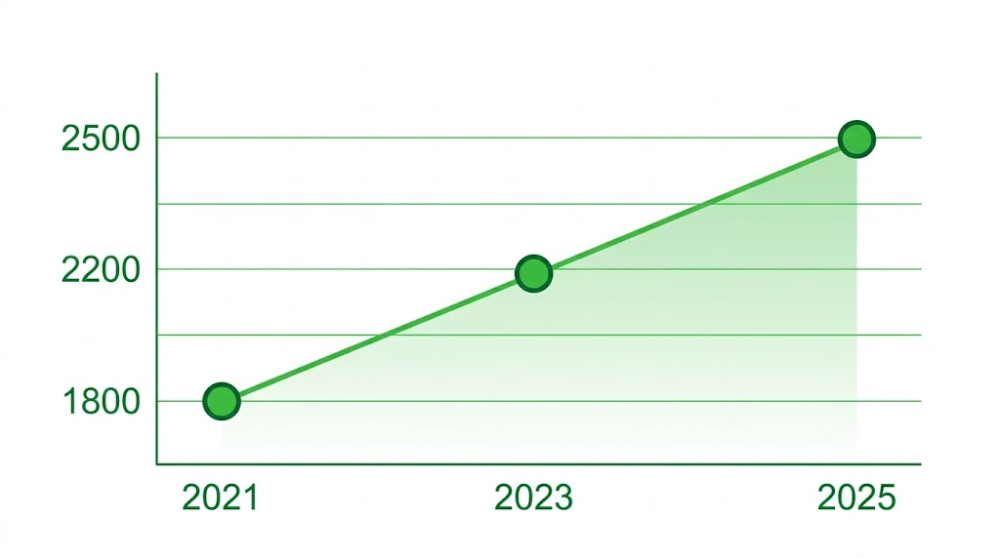
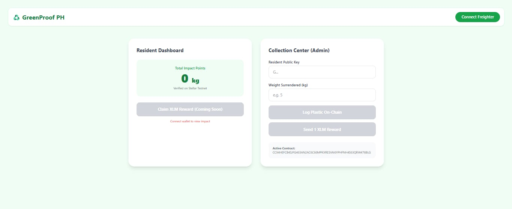
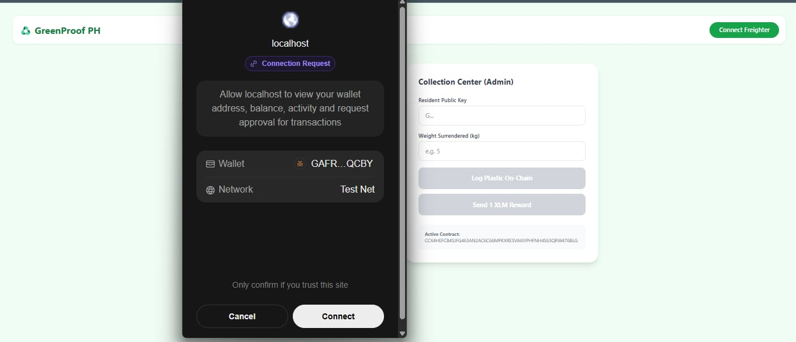
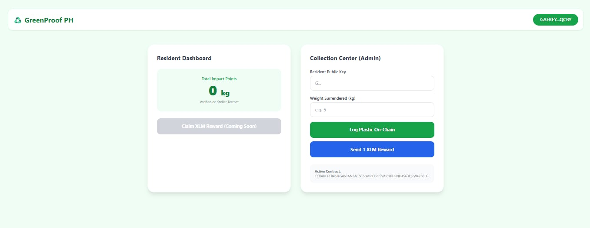
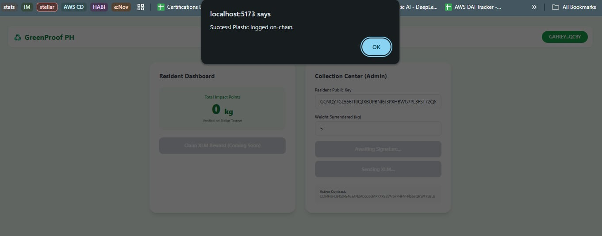
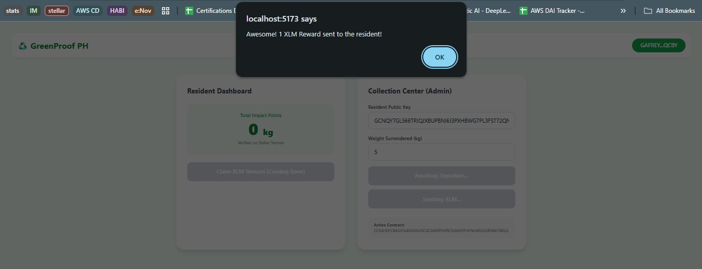

<div align="center">


</div>

<div align="center">
  
# Empowering Communities Through Recycling on Stellar

</div>

## ♻️ The Streets We Walk: Our Story and Inspiration

This project is deeply personal to me, born directly from my experiences living in Quezon City.

Every day, the reality of ineffective waste management is evident on our streets. Garbage accumulates in public spaces, and even minimal rain often leads to flooding, exacerbated by clogged waterways.

While the city provides garbage truck collection, it's a limited and rushed service, typically roaming for only two days a week and passing too quickly for residents to properly segregate or dispose of all their waste. This leaves a massive void, often filled by improper dumping and no true segregation of recyclables.

## 📊 The Scale of the Challenge: Data from Quezon City

We cannot ignore the scale of this problem. According to official data from the Quezon City government's 10-Year Solid Waste Management Plan (2021-2030), the city generates approximately 2,500 metric tons of solid waste every single day. This volume demonstrates the immense strain on our environment and infrastructure.



### Daily Waste Generation Visualization

To vividly illustrate this growing environmental pressure, imagine a clear upward trend in waste generation over the past several years:

It's clear that the current top-down, centralized approach—relying solely on city hall trucks—is insufficient. This led to a powerful idea: what if we empower residents to recycle properly instead of throwing garbage anywhere?

And what if we partner with our most local level of government—the LGU or Barangays—to not only manage collection locally but to actively reward citizens for their positive impact?

That's why we created GreenProof PH.

## 💡 The Solution: A Transparent Community Recycling Ledger

GreenProof PH is a transparent, decentralized application designed to bridge the gap between residents, local collection points (managed by Barangays/LGUs), and impactful environmental action.

By moving waste management from a fast-tracked service to a community-driven initiative with clear incentives, we aim to encourage proper segregation and recycling at the source—our homes. Residents will earn Impact Points (kg of segregated plastic) and real XLM rewards for their efforts.

## 🌟 Key Features

* **Transparency & Accountability:** Every kilogram of plastic segregated is recorded on the Stellar Testnet as transparent "Impact Points."
* **Empowering Local Partners:** Barangays and LGUs can be the heart of local collection, building stronger community ties and accountability.
* **Real Financial Incentives:** Earn direct XLM payouts for every successful plastic deposit, providing a tangible benefit for positive environmental behavior.
* **Direct Resident Engagement:** A simplified, empathetic dashboard for residents to track their contribution and rewards.

## 🛠️ How It Works

1.  **Segregate & Surrender:** Residents segregate recyclables at home (starting with plastic) and surrender it to their designated Barangay/LGU collection point.
2.  **Verify & Record:** The local partner weighs and verifies the deposit, recording the impact directly on the Stellar Testnet as Impact Points (1kg = 1 Point).
3.  **Earn XLM Rewards:** Accumulate enough Impact Points to be eligible for reward payouts in real XLM, sent directly to your connected wallet.

## 🚀 Impact and Scope

GreenProof PH is designed to positively impact waste management with a focused scope, starting with plastic waste as a pilot. By providing a scalable, localized model, we hope to demonstrate how communities can proactively tackle environmental challenges.

**Initial Sample Population & Focus:**

* **Sample Barangay:** Pilot the program in a specific Barangay within Quezon City to demonstrate feasibility.
* **Target Population:** Local households within the sample Barangay.
* **Initial Metric:** Focus on plastic waste (measured in kg), building data and trust before expanding to other waste categories.

## ⚙️ Environment Setup & Instructions

### Prerequisites

* Rust
* Stellar CLI

### Step 1: Build the Project

Compile the smart contract to WebAssembly (WASM).

```bash
cargo build --target wasm32-unknown-unknown --release
```
### Step 2: Test the Contract
Run the internal tests to verify core logic.

```Bash
cargo test
```
### Step 3: Deploy to Testnet
Upload your contract WASM to the Stellar Testnet. (Replace my-key with your configured source wallet alias).

```Bash
stellar contract deploy --wasm target/wasm32-unknown-unknown/release/greenproof_ph.wasm --source my-key --network testnet
```
### Step 4: Run the Frontend Locally
To see the actual application live on your local host, navigate to the frontend directory, install the dependencies, and start the development server.
```Bash
cd greenproof_ph/frontend
npm install
npm run dev
```
🌐 Live Deployment Overview
We are proud to have our initial smart contract successfully deployed to the Stellar Testnet.

Network: Stellar Testnet
```
Contract ID: CCX4HEFCB4SJFG463AN2AC6C66MPKXRESVAI6YPHFNH4S63QRW476BLG
```
Explorer Link: [View on Stellar Expert](https://stellar.expert/explorer/testnet/contract/CCX4HEFCB4SJFG463AN2AC6C66MPKXRESVAI6YPHFNH4S63QRW476BLG)

Here is a glimpse of our deployed contract on Stellar.Expert, showing its successful instantiation and ready status:


## User Interface






The Overview tab shows that the contract has been successfully instantiated. A clear timeline of transactions is visible below, detailing contract calls, creation events, and state changes. This overview provides verifiable proof of our live dApp on the Stellar network.

We are excited about the potential of GreenProof PH to foster a cleaner, more resilient, and directly empowered community in Quezon City and beyond.
